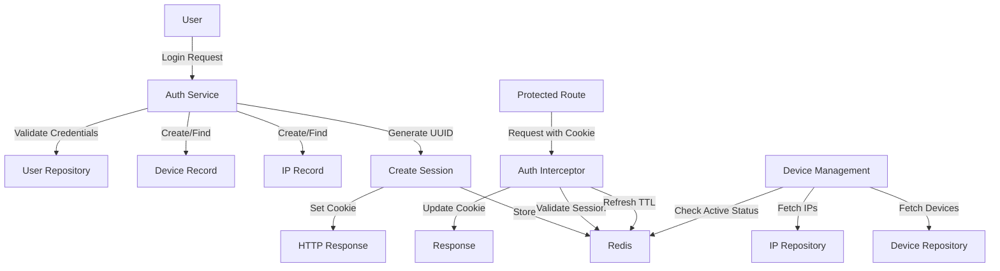
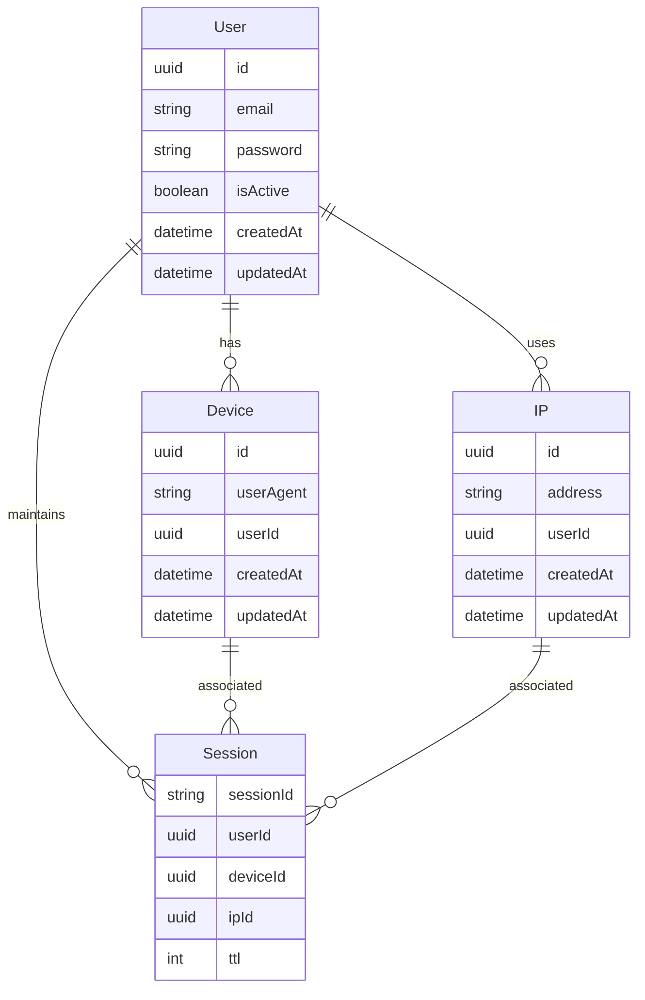

# Session-Based Authentication System with Device Management

## Overview

A secure session-based authentication system that tracks and manages user sessions across different devices and IP addresses. The system provides visibility and control over active sessions while maintaining security best practices.

## Technical Stack

- Backend: NestJS with TypeScript
- Frontend: Next.js with TypeScript
- Database: PostgreSQL for persistent storage
- Session Store: Redis for session management
- Authentication: HTTP-only cookies with session tokens

## Core Features

### 1. User Authentication

- Users can register with email and password
- Passwords are securely hashed using bcrypt
- Login creates a session with a unique UUID
- Sessions are stored in Redis with device and IP information
- HTTP-only cookies prevent XSS attacks

### 2. Session Management

- Sessions are stored in Redis using pattern: `session:${userId}:${sessionId}`
- Default TTL: 30 seconds (configurable for production)
- Sessions automatically refresh on any authenticated request
- Both Redis session and browser cookie TTL are synchronized
- Sessions invalidate automatically after inactivity

### 3. Device Tracking

- System records device information on each login
- Stores user agent strings
- Tracks first and last usage timestamps
- Links devices to specific user accounts
- Shows active/inactive status based on current sessions

### 4. IP Address Monitoring

- Records IP address for each login attempt
- Associates IPs with user accounts
- Maintains history of IP usage
- Links IPs to specific sessions

### 5. Device Management Interface

- Dashboard shows all devices used for login
- Displays:
  - User Agent information
  - IP Address
  - Last Used timestamp
  - Active/Inactive status
- Real-time status updates via refresh
- Responsive design for all screen sizes

## Security Features

- HTTP-only cookies prevent client-side access
- Secure password hashing
- Session tokens are UUIDs
- Redis key pattern prevents session enumeration
- Automatic session cleanup
- No sensitive data exposure

## Data Flow

1. User logs in → Create device and IP records
2. Generate session → Store in Redis with references
3. Set HTTP-only cookie → Client receives sessionId
4. Subsequent requests → Validate and refresh session
5. Session expiry → Automatic logout and cleanup

## Error Handling

- Invalid credentials → Unauthorized error
- Expired session → Redirect to login
- Network issues → Appropriate error messages
- Session validation → Proper error states

## Future Enhancements

- Multiple active sessions support
- Force logout from specific devices
- Geolocation tracking
- Session duration analytics
- Suspicious activity detection
- Enhanced device fingerprinting


## Mermaid Flowchart

## System Architecture Diagram
```mermaid
graph LR
    subgraph "Frontend Layer"
        A[Next.js App]
        B[Device Management UI]
        C[Auth Pages]
    end

    subgraph "API Layer"
        D[NestJS API]
        E[Auth Service]
        F[Auth Interceptor]
    end

    subgraph "Data Layer"
        G[PostgreSQL]
        H[Redis]
    end

    A --> D
    B --> D
    C --> D
    D --> G
    D --> H
  ```

  ## Session Flow Sequence

  ```mermaid
  sequenceDiagram
    participant U as User
    participant F as Frontend
    participant A as Auth Service
    participant R as Redis
    participant DB as PostgreSQL

    U->>F: Login Request
    F->>A: POST /auth/login
    A->>DB: Validate Credentials
    A->>DB: Create/Update Device
    A->>DB: Create/Update IP
    A->>R: Create Session
    A->>F: Set HTTP-only Cookie
    F->>U: Redirect to Dashboard

    U->>F: Access Protected Route
    F->>A: Request with Cookie
    A->>R: Validate Session
    A->>R: Refresh TTL
    A->>F: Update Cookie
    F->>U: Show Protected Content
```
## Entity Relationship Diagram:



## Redis Key Storage Pattern

```
Session Key Pattern:
session:{userId}:{sessionId}

Example:
session:123e4567-e89b-12d3-a456-426614174000:98765432-abcd-efgh-ijkl-987654321000

Value Structure:
{
  "deviceId": "uuid",
  "ipId": "uuid",
  "userId": "uuid"
}

```
